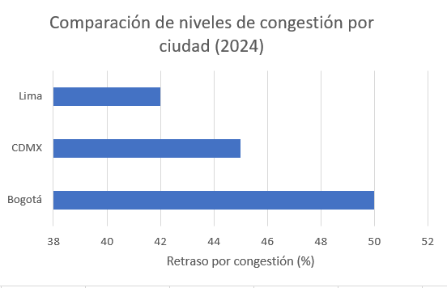
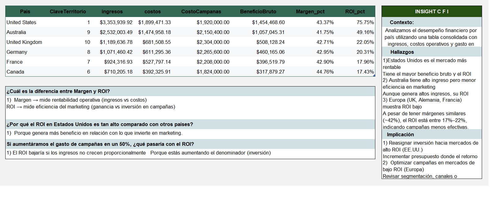

# Data Analyst Portfolio – Ana Villanueva

## About Me
Data Analyst with 15 years of experience in business areas, including operations, logistics, purchasing, and sales. 
Focused on data analysis to improve processes and support decision-making.

## Skills
- SQL
- Python (pandas)
- Power BI
- Excel
- Data Analysis
- Data Visualization

## Projects
## 🚖 Proyecto 1: Movilidad urbana y productividad económica en ciudades de Latinoamérica

**🔍 Problema:**  
Analizar cómo la congestión vehicular impacta la productividad económica en ciudades de Latinoamérica, con el objetivo de identificar dónde es más estratégico invertir en infraestructura de transporte.

**📊 Qué hice:**  
Trabajé con datos reales de tráfico (TomTom Traffic Index) y datos económicos (OECD), integrándolos para analizar la relación entre movilidad urbana y desempeño económico.

**⚙️ Proceso:**  
- Carga y exploración de datos con Python (pandas, numpy)  
- Limpieza y transformación de datos (formatos, fechas, valores numéricos)  
- Estandarización de columnas (snake_case)  
- Conversión de variables a tipos adecuados (datetime, float)  
- Creación de nuevas variables (año, población total)  
- Filtrado de datos relevantes (año 2024)  
- Agrupación y cálculo de promedios por ciudad  
- Análisis exploratorio para identificar patrones  

**📈 Resultados:**  
- Identifiqué que mayores niveles de congestión están asociados con menor eficiencia en tiempos de traslado  
- Detecté diferencias significativas entre ciudades en niveles de tráfico y desempeño  
- Generé una base consolidada por ciudad que permite comparar movilidad y condiciones económicas  

**🧠 Insight clave:**  
La congestión urbana no solo afecta la movilidad diaria, sino que impacta directamente en la eficiencia operativa y la productividad económica de las ciudades.

**🛠️ Skills:**  
Python | Pandas | Limpieza de datos | Transformación de datos | EDA | Análisis de datos

📊 **Interpretación:**
Bogotá presenta el mayor nivel de congestión, lo que indica un mayor impacto en tiempos de traslado y posibles efectos negativos en la productividad urbana, en comparación con CDMX y Lima.

📊 **Visualización:**

## 📊 Proyecto 2: Análisis financiero y rentabilidad por país

**🔍 Problema:**  
Evaluar el desempeño financiero por país para identificar qué mercados son más rentables y dónde optimizar la inversión en campañas de marketing.

**📊 Qué hice:**  
Trabajé con una tabla consolidada que incluye ingresos, costos operativos y gasto en campañas para analizar la rentabilidad y eficiencia de distintos mercados.

**⚙️ Proceso:**  
- Limpieza y validación de datos  
- Cálculo de métricas clave (Beneficio Bruto, Margen %, ROI %)  
- Comparación de desempeño entre países  
- Análisis de eficiencia de inversión en marketing  
- Identificación de patrones y oportunidades  

**📈 Resultados:**  
- Estados Unidos es el mercado más rentable, con mayor beneficio bruto y ROI  
- Australia presenta altos ingresos pero menor eficiencia en marketing  
- Europa (UK, Alemania, Francia) muestra ROI bajo a pesar de márgenes similares (~42%)  
- Se identificaron diferencias claras entre rentabilidad operativa (margen) y eficiencia de inversión (ROI)  

**🧠 Insight clave:**  
Un alto margen no garantiza un alto ROI; la eficiencia de la inversión en campañas es clave para maximizar la rentabilidad.

**📊 Interpretación:**  
Incrementar la inversión en mercados con alto ROI como Estados Unidos puede generar mayor retorno, mientras que en mercados con bajo ROI es necesario optimizar estrategias de marketing.

**🛠️ Skills:**  
Excel | Análisis de datos | KPIs | Finanzas | Toma de decisiones

📊 **Visualización:**

